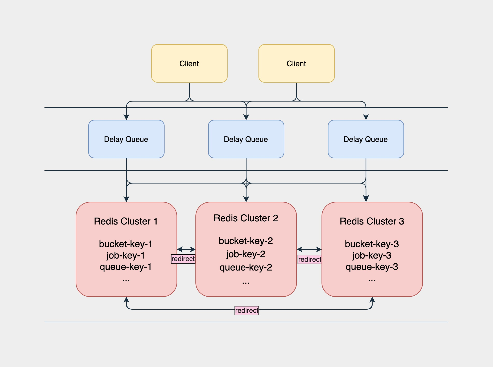

# delay-queue

[](https://goreportcard.com/report/github.com/changsongl/delay-queue)
[](https://travis-ci.com/changsongl/delay-queue)
[](https://hits.seeyoufarm.com)

````
  ____       _                ___                        
 |  _ \  ___| | __ _ _   _   / _ \ _   _  ___ _   _  ___ 
 | | | |/ _ \ |/ _` | | | | | | | | | | |/ _ \ | | |/ _ \
 | |_| |  __/ | (_| | |_| | | |_| | |_| |  __/ |_| |  __/
 |____/ \___|_|\__,_|\__, |  \__\_\\__,_|\___|\__,_|\___|
                     |___/   
````

### 介绍
**这个项目还在持续开发当中，功能还不完善到生产使用。当基本功能完成和单元测试覆盖后，
将发布Beta版本，提供大家使用。**

这个项目是仿照有赞的延迟队列进行设计的。现在这个队列是通过Redis来进行存储和实现分布式高可用的，
这个项目会进行存储的拓展，如MYSQL，RABBITMQ，内存等实现方式的集成。

### 高可用



### 如何运行 delay queue?
````shell
# clone project
git clone https://github.com/changsongl/delay-queue.git

# build the project
make

# run the project
bin/delayqueue
````

````shell
# flags
bin/delayqueue -help
  -config.file string
        config file (default "../../config/config.yaml")
  -config.type string
        config type: yaml, json
  -env string
        delay queue env: debug, release (default "release")
  -version
        display build info
````

### 使用用例
- ##### SDK [链接](https://github.com/changsongl/delay-queue-client)

- ##### Http

````
// Push job
POST 127.0.0.1:8000/topic/mytopic/job
body: {"id": "myid1","delay":10, "ttr":4, "body":"body"}

// response 
{
    "message": "ok",
    "success": true
}
````

````
// Pop job (timeout: 秒)
GET 127.0.0.1:8000/topic/mytopic/job?timeout=5

// response
{
    "message": "ok",
    "success": true,
    "data": {
        "body": "body",
        "delay": 10,
        "id": "myid1",
        "topic": "mytopic",
        "ttr": 4
    }
}
````

````
// Delete job
DELETE 127.0.0.1:8000/topic/mytopic/job/myid1

// response
{
    "message": "ok",
    "success": true
}
````

````
// Delete job
PUT 127.0.0.1:8000/topic/mytopic/job/myid1

// response
{
    "message": "ok",
    "success": true
}
````

### 设计

#### Terms
1. Job：需要异步处理的任务，是延迟队列里的基本单元。与具体的Topic关联在一起。
2. Topic：一组相同类型Job的集合（队列）。供消费者来订阅。

#### 任务
1. Topic：Job类型。可以理解成具体的业务名称。
2. Id：Job的唯一标识。用来检索和删除指定的Job信息。Topic和Id的组合应该是业务中唯一的。
3. Delay：Job需要延迟的时间。单位：秒。（服务端会将其转换为绝对时间）
4. TTR（time-to-run)：Job执行超时时间，超过此事件后，会将此Job再次发给消费者消费。单位：秒。
5. Body：Job的内容，供消费者做具体的业务处理，可以为json格式。


#### 组件

>有四个组件
>1. Job Pool: 用来存放所有Job的元信息。
>2. Delay Bucket: 是一组以时间为维度的有序队列，用来存放所有需要延迟的／已经被reserve的Job（这里只存放Job Id）。
>3. Timer: 负责实时扫描各个Bucket，并将delay时间大于等于当前时间的Job放入到对应的Ready Queue。
>4. Ready Queue: 存放处于Ready状态的Job（这里只存放Job Id），以供消费程序消费。


#### 状态
>Job的状态一共有4种，同一时间下只能有一种状态。
>1. ready：可执行状态，等待消费。
>2. delay：不可执行状态，等待时钟周期。
>3. reserved：已被消费者读取，但还未得到消费者的响应（delete、finish）。
>4. deleted：已被消费完成或者已被删除。


### 组件监控
项目使用普罗米修斯作为监控手段，暴露了metrics接口给普罗米修斯进行数据拉取。
你可以使用普罗米修斯和Grafana的作为自己的监控手段。

````
# HELP delay_queue_in_flight_jobs_numbers_in_bucket Gauge of the number of inflight jobs in each bucket
# TYPE delay_queue_in_flight_jobs_numbers_in_bucket gauge
delay_queue_in_flight_jobs_numbers_in_bucket{bucket="dq_bucket_0"} 0
delay_queue_in_flight_jobs_numbers_in_bucket{bucket="dq_bucket_1"} 3
delay_queue_in_flight_jobs_numbers_in_bucket{bucket="dq_bucket_2"} 0
delay_queue_in_flight_jobs_numbers_in_bucket{bucket="dq_bucket_3"} 0
delay_queue_in_flight_jobs_numbers_in_bucket{bucket="dq_bucket_4"} 0
delay_queue_in_flight_jobs_numbers_in_bucket{bucket="dq_bucket_5"} 0
delay_queue_in_flight_jobs_numbers_in_bucket{bucket="dq_bucket_6"} 0
delay_queue_in_flight_jobs_numbers_in_bucket{bucket="dq_bucket_7"} 0
.
.
.
# HELP delay_queue_in_flight_jobs_numbers_in_queue Gauge of the number of inflight jobs in each queue
# TYPE delay_queue_in_flight_jobs_numbers_in_queue gauge
delay_queue_in_flight_jobs_numbers_in_queue{queue="dq_queue_mytopic"} 1
````

### 项目计划
我将持续打磨这个项目，并且加入更多的功能和修复问题。我将会让这个项目可以投入到生产环境使用。
如果喜欢的话，欢迎给个星或者Fork参与进来，这里欢迎你的贡献！
 
### 如何贡献?
1. 在Issue里发布自己的问题或评论。
2. 我们会在问题中进行讨论，并进行设计如何开发。
3. Fork项目进行开发，并以develop分支，创建自己的分支进行开发。如fix-xxx, feature-xxx等等。
4. 开发完成后，发起PR合入develop。
5. Code Review后将会把你的代码合进分支。

### Stargazers
[](https://starchart.cc/changsongl/delay-queue) 

### Reference

Youzan Design Concept [Youzan Link](https://tech.youzan.com/queuing_delay/)
